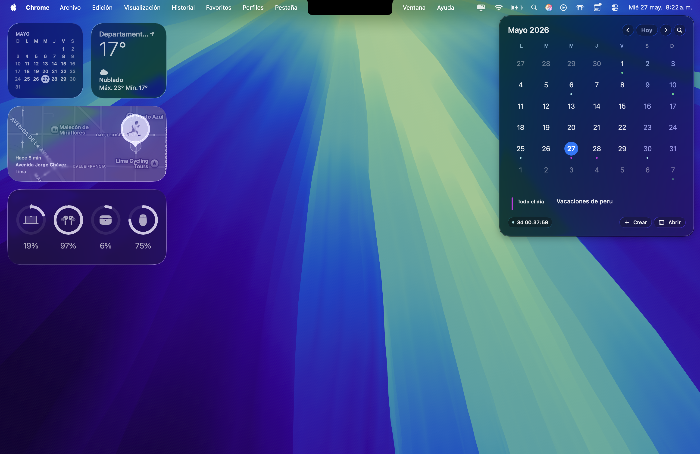
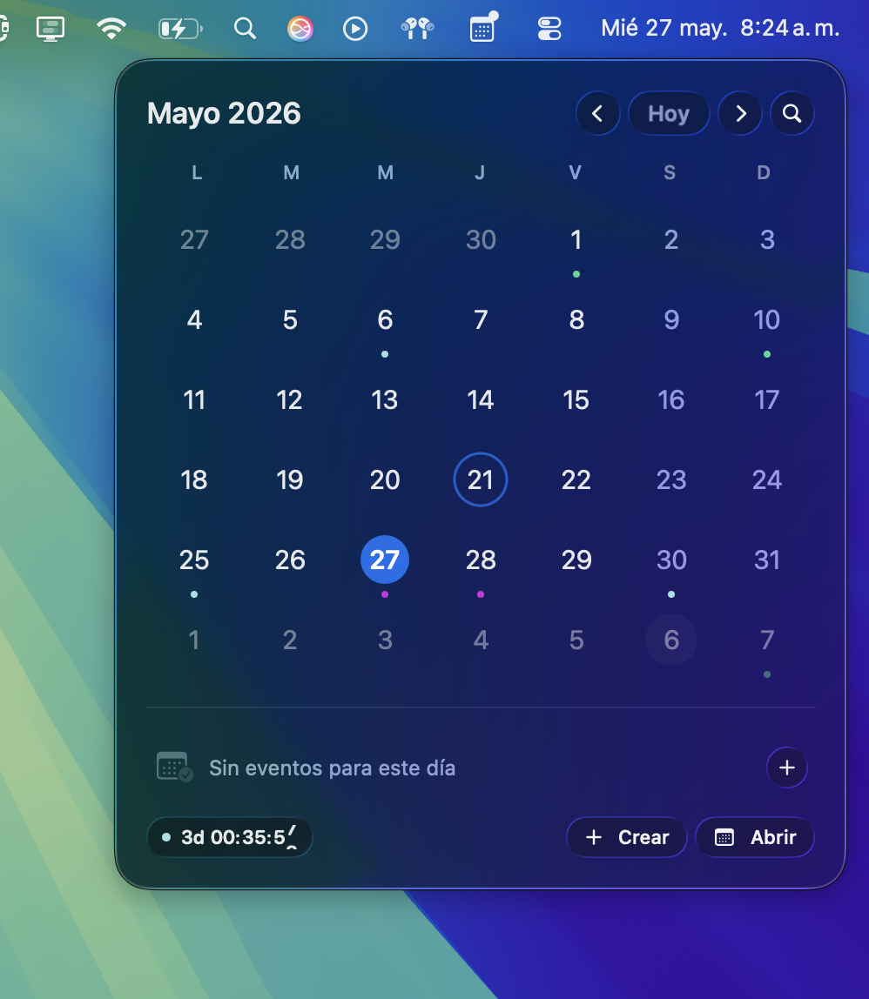
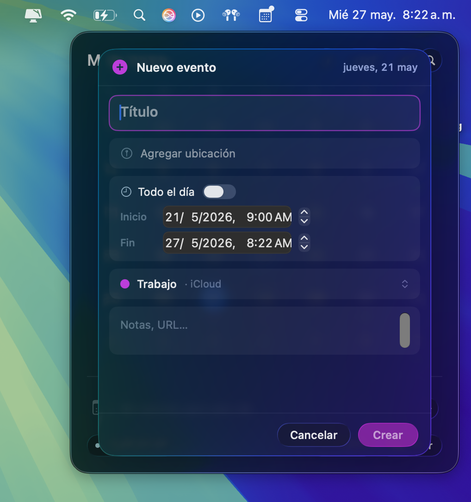

# Tahoe Glass Calendar

A small, native macOS menu bar calendar built with SwiftUI and Liquid Glass for macOS Tahoe.

Tahoe Glass Calendar gives you a fast way to check your month, today's events, upcoming countdowns, and create or edit calendar events without opening Calendar.app every time.

## Demo

[](https://resourcefileswsp.s3.us-east-1.amazonaws.com/calendar-video.mp4)

[Watch the demo video](https://resourcefileswsp.s3.us-east-1.amazonaws.com/calendar-video.mp4)

## Why This Exists

macOS Calendar is powerful, but it can feel heavy when all you need is a quick glance at your day. Tahoe Glass Calendar was built to solve that tiny but constant friction:

- See your calendar directly from the menu bar.
- Check today's events without switching apps.
- Jump to Calendar.app only when you need the full app.
- Create, edit, and delete events from a compact native popover.
- Keep the UI aligned with the macOS Tahoe Liquid Glass design language.

## Screenshots

| Calendar popover | Event details |
| --- | --- |
|  |  |

## Features

- Menu bar calendar with a compact monthly grid.
- Native Liquid Glass panel on macOS Tahoe.
- Event list for the selected day.
- Quick event creation and editing.
- Inline delete confirmation.
- Search across a wider calendar window around the visible month.
- Countdown for the next upcoming event.
- Optional upcoming event text directly in the menu bar.
- Opens Apple Calendar at the selected date or event date.
- Calendar permission handling.
- Local notifications for upcoming events.
- Launch at login support from the app menu.

## Requirements

Tahoe Glass Calendar is a source-built macOS app.

- macOS Tahoe 26.0 or later.
- Xcode with the macOS 26 SDK installed.
- Command Line Tools available through `xcodebuild`.
- Calendar access permission.
- Optional: Notification permission for event reminders.
- Optional: Automation permission for opening Calendar.app at an exact date.

The app is currently installed with ad-hoc signing. It is not distributed through the App Store and is not notarized.

## Installation

Clone the repository:

```bash
git clone https://github.com/alvarez25leo/TahoeGlassCalendar.git
cd TahoeGlassCalendar
```

Build, install to `/Applications`, and launch:

```bash
./install.sh --launch
```

If macOS asks for Calendar access on first launch, allow it. The app needs this permission to read and show your events.

## One-Line Install Command

If you already have the repository cloned locally:

```bash
cd TahoeGlassCalendar && ./install.sh --launch
```

If you only want to see the last few installer lines:

```bash
cd TahoeGlassCalendar && ./install.sh --launch 2>&1 | tail -5
```

For a fresh clone:

```bash
git clone https://github.com/alvarez25leo/TahoeGlassCalendar.git
cd TahoeGlassCalendar
./install.sh --launch
```

## What the Installer Does

`install.sh` performs a local Release build and installs the app into `/Applications`:

```bash
xcodebuild -project TahoeGlassCalendar.xcodeproj \
  -scheme TahoeGlassCalendar \
  -configuration Release \
  -destination 'platform=macOS'
```

Then it:

- Stops any previous running copy.
- Copies `TahoeGlassCalendar.app` into `/Applications`.
- Signs it locally with ad-hoc signing and the required entitlements.
- Removes quarantine attributes when possible.
- Launches the app when `--launch` is passed.

## Permissions

Tahoe Glass Calendar asks only for permissions needed by its features.

### Calendar Access

Required. Used to read, create, edit, and delete calendar events.

If you deny access by mistake:

1. Open **System Settings**.
2. Go to **Privacy & Security**.
3. Open **Calendars**.
4. Enable Tahoe Glass Calendar.

### Notifications

Optional. Used for upcoming event reminders.

### Automation for Calendar.app

Optional. Used when the app opens Apple Calendar directly at a selected date. If denied, Tahoe Glass Calendar can still open Calendar.app normally.

## Usage

After launching, Tahoe Glass Calendar appears in the macOS menu bar.

- Click the menu bar icon to open the calendar popover.
- Select a day to see its events.
- Use the arrow buttons to move between months.
- Use **Today** to return to the current month.
- Use the search button or `Command + F` to search events.
- Use **Create** or `Command + N` to add an event.
- Right-click an event to edit or delete it.
- Use **Open** or `Command + O` to open Calendar.app.

## Moving the Menu Bar Icon

You can place the icon wherever you prefer in the macOS menu bar:

1. Hold the **Command** key.
2. Drag the Tahoe Glass Calendar icon left or right.
3. Drop it in the position where you want it to stay.

Be careful not to drag it down and out of the menu bar unless you want to remove it from the visible menu bar area. If it disappears, launch Tahoe Glass Calendar again from `/Applications`.

## Launch at Login

You can enable launch at login from the app's menu:

1. Right-click the Tahoe Glass Calendar menu bar icon.
2. Enable **Start at Login**.

You can also add it manually:

1. Open **System Settings**.
2. Go to **General**.
3. Open **Login Items**.
4. Add `/Applications/TahoeGlassCalendar.app`.

## Uninstall

From the cloned repository:

```bash
./install.sh --uninstall
```

This removes the app from `/Applications` and resets its Calendar permission entry.

You can also remove it manually:

```bash
rm -rf /Applications/TahoeGlassCalendar.app
```

## Troubleshooting

### The app does not show events

Check Calendar permission in **System Settings > Privacy & Security > Calendars**.

### Calendar.app does not open at the selected date

Check Automation permission in **System Settings > Privacy & Security > Automation**. Tahoe Glass Calendar uses AppleScript only for date-specific navigation in Calendar.app.

### The menu bar icon disappeared

Launch the app again from `/Applications`. You can then hold **Command** and drag the icon to the position you want.

### Build fails

Make sure you are using a macOS Tahoe-compatible Xcode with the macOS 26 SDK:

```bash
xcodebuild -version
xcodebuild -showsdks
```

Then try:

```bash
./install.sh --launch
```

## Development

Open the project in Xcode:

```bash
open TahoeGlassCalendar.xcodeproj
```

Run tests from Terminal:

```bash
xcodebuild test \
  -project TahoeGlassCalendar.xcodeproj \
  -scheme TahoeGlassCalendar \
  -destination 'platform=macOS'
```

Build a local Release copy:

```bash
./install.sh
```

## License

Tahoe Glass Calendar is released under the [MIT License](LICENSE).

You can use, copy, modify, distribute, and commercialize the app freely. The only requirement is to keep the copyright and license notice so the original developer is credited.

## Repository

[github.com/alvarez25leo/TahoeGlassCalendar](https://github.com/alvarez25leo/TahoeGlassCalendar)
